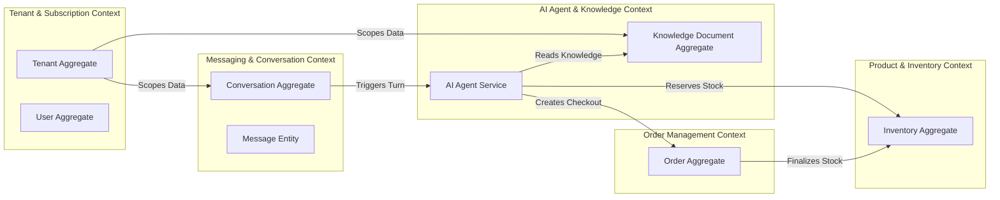
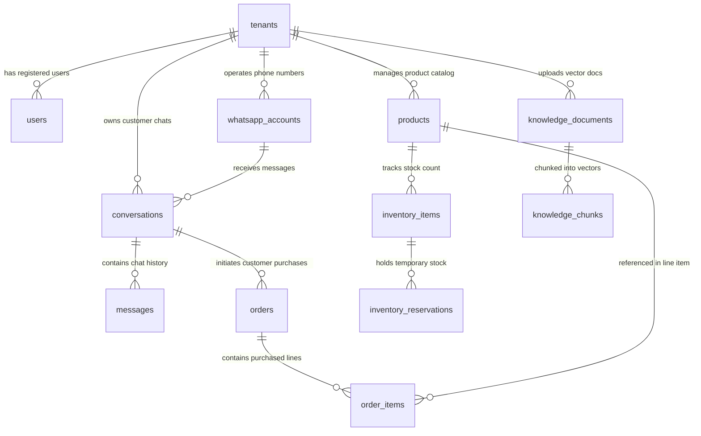
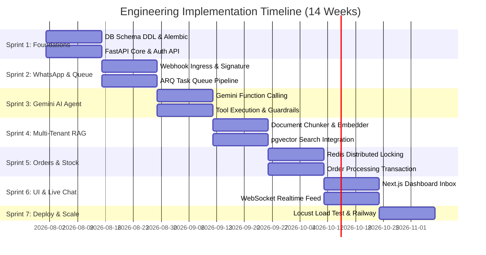

# Enterprise Multi-Tenant WhatsApp AI Automation Platform
## Master Technical Architecture Specification & Engineering Blueprint

---

### Document Control & Metadata
- **Author**: Lead Systems Architect & Principal Software Engineer
- **Platform**: Multi-Tenant B2B SaaS WhatsApp AI Automation Platform
- **Target OS**: Cross-Platform (Linux/Docker/Windows)
- **Document Version**: 1.0.0 (Production Blueprint)
- **Status**: APPROVED FOR IMPLEMENTATION

---

## Executive Summary & Design Philosophy
This engineering specification defines the complete production architecture for a multi-tenant B2B SaaS platform enabling businesses to integrate WhatsApp Business Cloud API with an autonomous Gemini-powered AI agent.

### Key Architecture Drivers:
1. **Strict Multi-Tenant Isolation**: Row-Level Security (RLS) and tenant-scoped dynamic contexts guarantee absolute data separation across database, cache, vector storage, and background jobs.
2. **Phase 1 (POC) to Phase 2 (Enterprise) Evolution**: Built using Supabase (PostgreSQL + pgvector), Upstash Redis, Railway, Vercel, ARQ workers, and Google AI Studio (Gemini 1.5/2.0 Flash/Pro). Upgradeable to Qdrant, Kafka, and sharded PostgreSQL clusters without re-architecting domain contracts.
3. **Resilient Concurrency & Inventory Protection**: Redis Distributed Locking (Redlock pattern) + PostgreSQL Optimistic Locking ensure zero overselling during high-volume customer spikes.
4. **Deterministic AI Tool Execution**: Schema-constrained function calling via Gemini with strict Pydantic v2 validation, prompt injection defense, and automated human escalation workflows.

---

## Chapter 1: Overall System Architecture

### 1.1 Architecture Topology
The architecture uses an asynchronous, event-driven pattern decoupled through an ingress gateway, distributed task queue, relational/vector hybrid database, and external API integrations.

```mermaid
graph TD
    subgraph External System Layer
        WA[WhatsApp Cloud API / Meta Webhooks]
        Client[Business Dashboard User]
        Gemini[Google Gemini 1.5 / 2.0 API]
    end

    subgraph Edge & Ingress Layer
        Vercel[Vercel Edge Platform / Next.js 14 App]
        RailwayAPI[Railway Container / FastAPI App Gateway]
    end

    subgraph Messaging & Task Orchestration
        RedisQueue[(Upstash Redis Broker & Distributed Lock Engine)]
        ARQCluster[ARQ Worker Pool - Async Processing]
    end

    subgraph Multi-Tenant Data & Storage Layer
        DB[(Supabase PostgreSQL 16 + pgvector)]
        Storage[(Supabase Object Storage - Documents & Media)]
    end

    %% Webhook Processing Sequence
    WA -->|1. Inbound Webhook POST| RailwayAPI
    RailwayAPI -->|2. Meta HMAC Verification & Deduplication| RedisQueue
    RailwayAPI-->>WA: 3. 200 OK (Instant Receipt Response)
    RedisQueue -->|4. Consume Task| ARQCluster
    
    %% AI & Data Pipeline
    ARQCluster -->|5. Load Tenant Profile & Context| DB
    ARQCluster -->|6. Cosine Similarity Vector Search| DB
    ARQCluster -->|7. Infer Intent & Function Call| Gemini
    Gemini -->|8. Return Structured Function Request| ARQCluster
    ARQCluster -->|9. Execute Transaction & Distributed Lock| DB
    ARQCluster -->|10. Send Outbound Text/Interactive Message| WA

    %% Dashboard Management Flow
    Client -->|HTTPS / WSS| Vercel
    Vercel -->|REST API / Realtime Data| RailwayAPI
    RailwayAPI -->|Tenant-Scoped Queries| DB
```

### 1.2 Multi-Tenancy Scoping Model
Every operation across the platform requires a resolved `tenant_id` context.

```
+-----------------------------------------------------------------------------------+
|                                  HTTP REQUEST                                     |
|  Headers: Authorization: Bearer <JWT> OR Meta Webhook Payload (Phone Number ID)   |
+-----------------------------------------------------------------------------------+
                                         |
                                         v
+-----------------------------------------------------------------------------------+
|                           TENANT RESOLUTION MIDDLEWARE                             |
|  Resolves tenant_id -> Binds to Python ContextVar (tenant_context)                 |
+-----------------------------------------------------------------------------------+
                                         |
             +---------------------------+---------------------------+
             |                           |                           |
             v                           v                           v
+------------------------+  +------------------------+  +------------------------+
|   PostgreSQL Engine    |  |     Redis Namespacing  |  |    pgvector Engine     |
| SET LOCAL              |  | key:                   |  | WHERE tenant_id =      |
| app.current_tenant_id  |  | tenant:{id}:res:{id}   |  | current_tenant_id      |
+------------------------+  +------------------------+  +------------------------+
```

### 1.3 POC vs Production Evolution Matrix

| Architectural Layer | Phase 1 (POC Setup) | Phase 2 (Enterprise Upgrade) | Refactoring Effort |
| :--- | :--- | :--- | :--- |
| **API Backend** | FastAPI Monolith (Railway) | FastAPI Modular Services / Microservices | Low (DDD Interfaces preserved) |
| **Task Queue** | ARQ + Upstash Redis | Apache Kafka / RabbitMQ | Medium (Task adapter pattern used) |
| **Database** | Supabase PostgreSQL 16 | AWS Aurora PostgreSQL (Sharded) | Low (SQLAlchemy abstraction layer) |
| **Vector Engine** | pgvector (HNSW Index) | Dedicated Qdrant / Milvus Cluster | Low (VectorStore Repository Interface) |
| **Cache & Locks** | Upstash Serverless Redis | Multi-node Dragonfly / Redis Cluster | Minimal (Redis client compatible) |
| **Frontend** | Vercel Next.js App Router | Vercel Edge + Multi-region CDN | Minimal (App Router modularized) |

---

## Chapter 2: Project Directory & File Responsibilities

### 2.1 Backend Project Directory Structure (`/backend`)

```
backend/
├── alembic/                          # DB Migration scripts
│   ├── versions/                     # Migration step files
│   └── env.py                        # Async Alembic execution environment
├── app/
│   ├── api/
│   │   ├── v1/
│   │   │   ├── endpoints/
│   │   │   │   ├── auth.py           # JWT Authentication, login, signup
│   │   │   │   ├── webhook.py        # Meta WhatsApp Webhook Ingestion & Verification
│   │   │   │   ├── conversations.py  # Chat history, live monitoring, handoff API
│   │   │   │   ├── products.py       # Catalog CRUD & stock adjustment API
│   │   │   │   ├── orders.py         # Order listing, status update API
│   │   │   │   ├── knowledge.py      # File upload, chunking & RAG indexing API
│   │   │   │   └── analytics.py      # Usage metrics & reporting API
│   │   │   └── router.py             # Top-level API v1 router definition
│   │   └── dependencies.py           # FastAPI dependency providers (DB session, Auth user, Tenant context)
│   ├── core/
│   │   ├── config.py                 # Environment variable validation via Pydantic Settings
│   │   ├── database.py               # Async SQLAlchemy engine & session factory setup
│   │   ├── redis.py                  # Redis connection manager & ping checker
│   │   ├── security.py               # Password hashing (argon2/bcrypt) & JWT encode/decode
│   │   └── logging.py                # Structured JSON logging via structlog
│   ├── domain/
│   │   ├── conversation/
│   │   │   ├── models.py             # SQLAlchemy models: Conversation, Message
│   │   │   ├── schemas.py            # Pydantic Schemas: MessageCreate, ConversationOut
│   │   │   ├── state_machine.py      # State Machine logic & valid transition checks
│   │   │   ├── services.py           # Business logic: Context building, handoff toggle
│   │   │   └── repository.py         # Async DB queries for conversations & messages
│   │   ├── ai/
│   │   │   ├── prompt_builder.py     # System Prompt Compiler & Context Injector
│   │   │   ├── gemini_client.py      # Google AI Studio API wrapper with retries & error handling
│   │   │   ├── tool_registry.py      # Declarative Gemini Tool JSON Schemas
│   │   │   ├── tool_executors.py     # Execution handlers matching function names
│   │   │   └── guardrails.py         # Input sanitization & prompt injection shielding
│   │   ├── rag/
│   │   │   ├── parser.py             # File parsers: PyPDF, docx2txt, plain text
│   │   │   ├── chunker.py            # Recursive character chunker with token limits
│   │   │   ├── embedder.py           # Google text-embedding-004 client wrapper
│   │   │   ├── vector_store.py       # pgvector distance search repository
│   │   │   └── retriever.py          # Hybrid RAG search engine (Semantic + Full text)
│   │   ├── inventory/
│   │   │   ├── models.py             # Product, InventoryItem, InventoryReservation models
│   │   │   ├── locking.py            # Redlock Redis distributed locking & Pessimistic DB locks
│   │   │   └── service.py            # Stock reservation, release, & stock reconciliation
│   │   ├── order/
│   │   │   ├── models.py             # Order, OrderItem models
│   │   │   ├── state_machine.py      # Order state flow transitions
│   │   │   └── service.py            # Order creation & transactional checkout
│   │   └── tenant/
│   │       ├── models.py             # Tenant, User, Subscription models
│   │       └── service.py            # Tenant provisioning & feature flag / rate limit check
│   ├── workers/
│   │   ├── arq_config.py             # ARQ Queue pool & redis connection setup
│   │   ├── tasks_webhook.py          # Async WhatsApp message ingest & AI turn task
│   │   ├── tasks_rag.py              # Background document processing & vector embedding task
│   │   └── tasks_cron.py             # Scheduled cron: Sweeping expired reservations
│   └── main.py                       # FastAPI Application entrypoint & middleware mounting
├── tests/
│   ├── conftest.py                   # Pytest fixtures (Async DB session, test client, mock redis)
│   ├── unit/                         # Unit tests for domain services & prompt builder
│   ├── integration/                  # API route integration tests
│   └── e2e/                          # Simulated WhatsApp Webhook flow tests
├── Dockerfile                        # Production multi-stage Docker build
├── docker-compose.yml                # Local development stack (FastAPI, Postgres+pgvector, Redis)
├── pyproject.toml                    # Python project configuration (uv/poetry)
└── README.md                         # Developer setup guide
```

### 2.2 Frontend Project Directory Structure (`/frontend`)

```
frontend/
├── src/
│   ├── app/
│   │   ├── (auth)/
│   │   │   ├── login/page.tsx        # Sign-in view
│   │   │   └── register/page.tsx     # Tenant onboarding view
│   │   ├── (dashboard)/
│   │   │   ├── layout.tsx            # Authenticated sidebar & header layout
│   │   │   ├── page.tsx              # Analytics Overview dashboard
│   │   │   ├── conversations/
│   │   │   │   └── page.tsx          # Live WhatsApp inbox & manual agent takeover UI
│   │   │   ├── inventory/
│   │   │   │   └── page.tsx          # Catalog & real-time stock management UI
│   │   │   ├── orders/
│   │   │   │   └── page.tsx          # Order tracking & management table
│   │   │   ├── knowledge-base/
│   │   │   │   └── page.tsx          # RAG document upload & indexing monitor
│   │   │   └── settings/
│   │   │       └── page.tsx          # WhatsApp API setup, AI rules & billing
│   │   ├── api/                      # Next.js Server Route Handlers (if needed)
│   │   ├── layout.tsx                # Global Root Layout & Font Providers
│   │   └── page.tsx                  # Landing / Marketing Page
│   ├── components/
│   │   ├── ui/                       # shadcn/ui primitive components (Button, Dialog, etc.)
│   │   ├── chat/                     # Live agent chat window, message bubbler, input box
│   │   ├── inventory/                # Product form dialogs, stock counter adjustments
│   │   └── knowledge/                # Document dropzone & embedding status badges
│   ├── hooks/
│   │   ├── use-chat.ts               # WebSocket connection hook for live messages
│   │   ├── use-conversations.ts      # TanStack Query hook for fetching conversations
│   │   └── use-tenant.ts             # Active tenant state hook
│   ├── lib/
│   │   ├── api-client.ts             # Axios/Fetch wrapper with JWT auto-refresh
│   │   └── utils.ts                  # Classname merging & date format helpers
│   ├── services/
│   │   ├── auth-service.ts           # Login/Logout REST calls
│   │   └── conversation-service.ts   # Message fetching & handoff toggling REST calls
│   └── types/
│       ├── api.d.ts                  # OpenAPI typed interfaces
│       └── domain.d.ts               # Core entity TypeScript declarations
├── tailwind.config.js                # Tailwind CSS Configuration with CSS Variables
├── tsconfig.json                     # TypeScript strict configuration
└── package.json                      # Next.js dependencies
```

---

## Chapter 3: Domain-Driven Design (DDD) Boundaries

### 3.1 Domain Context Breakdown



### 3.2 Repository and Service Contracts

#### Conversation Repository Contract (`backend/app/domain/conversation/repository.py`)
```python
from abc import ABC, abstractmethod
from uuid import UUID
from typing import Optional, List
from app.domain.conversation.models import Conversation, Message

class ConversationRepositoryInterface(ABC):

    @abstractmethod
    async def get_by_id(self, tenant_id: UUID, conversation_id: UUID) -> Optional[Conversation]:
        """Fetch conversation by ID within tenant scope."""
        pass

    @abstractmethod
    async def get_by_customer_phone(self, tenant_id: UUID, customer_phone: str) -> Optional[Conversation]:
        """Fetch existing conversation by customer phone number."""
        pass

    @abstractmethod
    async def create(self, conversation: Conversation) -> Conversation:
        """Persist a new conversation."""
        pass

    @abstractmethod
    async def append_message(self, message: Message) -> Message:
        """Persist a new message into a conversation."""
        pass

    @abstractmethod
    async def get_recent_history(self, conversation_id: UUID, limit: int = 10) -> List[Message]:
        """Fetch the last N messages ordered chronologically."""
        pass
```

---

## Chapter 4: Database Design & Production SQL DDL

### 4.1 Database Entity-Relationship Diagram (ERD)



### 4.2 Production PostgreSQL DDL (PostgreSQL 16 + pgvector + RLS)

```sql
-- =============================================================================
-- SYSTEM EXTENSIONS & SETUP
-- =============================================================================
CREATE EXTENSION IF NOT EXISTS "uuid-ossp";
CREATE EXTENSION IF NOT EXISTS "pgcrypto";
CREATE EXTENSION IF NOT EXISTS "vector";

-- =============================================================================
-- 1. TENANTS TABLE
-- =============================================================================
CREATE TABLE tenants (
    id UUID PRIMARY KEY DEFAULT gen_random_uuid(),
    name VARCHAR(255) NOT NULL,
    slug VARCHAR(100) UNIQUE NOT NULL,
    plan_tier VARCHAR(50) NOT NULL DEFAULT 'starter' CHECK (plan_tier IN ('starter', 'professional', 'enterprise')),
    is_active BOOLEAN NOT NULL DEFAULT TRUE,
    monthly_message_limit INT NOT NULL DEFAULT 1000,
    monthly_messages_used INT NOT NULL DEFAULT 0,
    created_at TIMESTAMPTZ NOT NULL DEFAULT NOW(),
    updated_at TIMESTAMPTZ NOT NULL DEFAULT NOW(),
    deleted_at TIMESTAMPTZ NULL
);

CREATE INDEX idx_tenants_slug ON tenants(slug) WHERE deleted_at IS NULL;

-- =============================================================================
-- 2. USERS TABLE
-- =============================================================================
CREATE TABLE users (
    id UUID PRIMARY KEY DEFAULT gen_random_uuid(),
    tenant_id UUID NOT NULL REFERENCES tenants(id) ON DELETE CASCADE,
    email VARCHAR(255) NOT NULL,
    password_hash VARCHAR(255) NOT NULL,
    full_name VARCHAR(255) NOT NULL,
    role VARCHAR(50) NOT NULL DEFAULT 'agent' CHECK (role IN ('admin', 'manager', 'agent')),
    created_at TIMESTAMPTZ NOT NULL DEFAULT NOW(),
    updated_at TIMESTAMPTZ NOT NULL DEFAULT NOW(),
    deleted_at TIMESTAMPTZ NULL,
    CONSTRAINT uq_tenant_user_email UNIQUE (tenant_id, email)
);

CREATE INDEX idx_users_tenant ON users(tenant_id) WHERE deleted_at IS NULL;

-- =============================================================================
-- 3. WHATSAPP ACCOUNTS TABLE
-- =============================================================================
CREATE TABLE whatsapp_accounts (
    id UUID PRIMARY KEY DEFAULT gen_random_uuid(),
    tenant_id UUID NOT NULL REFERENCES tenants(id) ON DELETE CASCADE,
    phone_number_id VARCHAR(100) UNIQUE NOT NULL,
    waba_id VARCHAR(100) NOT NULL,
    display_phone_number VARCHAR(50) NOT NULL,
    access_token_encrypted TEXT NOT NULL,
    webhook_verify_token VARCHAR(255) NOT NULL,
    created_at TIMESTAMPTZ NOT NULL DEFAULT NOW(),
    updated_at TIMESTAMPTZ NOT NULL DEFAULT NOW()
);

CREATE INDEX idx_wa_accounts_tenant ON whatsapp_accounts(tenant_id);

-- =============================================================================
-- 4. CONVERSATIONS TABLE
-- =============================================================================
CREATE TABLE conversations (
    id UUID PRIMARY KEY DEFAULT gen_random_uuid(),
    tenant_id UUID NOT NULL REFERENCES tenants(id) ON DELETE CASCADE,
    whatsapp_account_id UUID NOT NULL REFERENCES whatsapp_accounts(id),
    customer_phone VARCHAR(50) NOT NULL,
    customer_name VARCHAR(255) NULL,
    status VARCHAR(50) NOT NULL DEFAULT 'AI_ACTIVE' CHECK (status IN ('AI_ACTIVE', 'AWAITING_CUSTOMER', 'HUMAN_ESCALATED', 'CLOSED')),
    assigned_user_id UUID NULL REFERENCES users(id) ON DELETE SET NULL,
    last_activity_at TIMESTAMPTZ NOT NULL DEFAULT NOW(),
    created_at TIMESTAMPTZ NOT NULL DEFAULT NOW(),
    updated_at TIMESTAMPTZ NOT NULL DEFAULT NOW(),
    deleted_at TIMESTAMPTZ NULL,
    CONSTRAINT uq_tenant_customer_phone UNIQUE (tenant_id, customer_phone)
);

CREATE INDEX idx_conversations_tenant_status ON conversations(tenant_id, status) WHERE deleted_at IS NULL;
CREATE INDEX idx_conversations_activity ON conversations(tenant_id, last_activity_at DESC);

-- =============================================================================
-- 5. MESSAGES TABLE
-- =============================================================================
CREATE TABLE messages (
    id UUID PRIMARY KEY DEFAULT gen_random_uuid(),
    tenant_id UUID NOT NULL REFERENCES tenants(id) ON DELETE CASCADE,
    conversation_id UUID NOT NULL REFERENCES conversations(id) ON DELETE CASCADE,
    wamid VARCHAR(255) UNIQUE NULL,
    sender_type VARCHAR(20) NOT NULL CHECK (sender_type IN ('CUSTOMER', 'AI', 'HUMAN_AGENT', 'SYSTEM')),
    content TEXT NOT NULL,
    meta_payload JSONB DEFAULT '{}'::jsonb,
    created_at TIMESTAMPTZ NOT NULL DEFAULT NOW()
);

CREATE INDEX idx_messages_conversation_time ON messages(conversation_id, created_at ASC);

-- =============================================================================
-- 6. PRODUCTS TABLE
-- =============================================================================
CREATE TABLE products (
    id UUID PRIMARY KEY DEFAULT gen_random_uuid(),
    tenant_id UUID NOT NULL REFERENCES tenants(id) ON DELETE CASCADE,
    sku VARCHAR(100) NOT NULL,
    name VARCHAR(255) NOT NULL,
    description TEXT NULL,
    price NUMERIC(12, 2) NOT NULL CHECK (price >= 0),
    currency VARCHAR(3) NOT NULL DEFAULT 'USD',
    is_active BOOLEAN NOT NULL DEFAULT TRUE,
    created_at TIMESTAMPTZ NOT NULL DEFAULT NOW(),
    updated_at TIMESTAMPTZ NOT NULL DEFAULT NOW(),
    deleted_at TIMESTAMPTZ NULL,
    CONSTRAINT uq_tenant_product_sku UNIQUE (tenant_id, sku)
);

CREATE INDEX idx_products_tenant_active ON products(tenant_id, is_active) WHERE deleted_at IS NULL;

-- =============================================================================
-- 7. INVENTORY ITEMS TABLE (WITH OPTIMISTIC LOCK VERSION)
-- =============================================================================
CREATE TABLE inventory_items (
    id UUID PRIMARY KEY DEFAULT gen_random_uuid(),
    tenant_id UUID NOT NULL REFERENCES tenants(id) ON DELETE CASCADE,
    product_id UUID UNIQUE NOT NULL REFERENCES products(id) ON DELETE CASCADE,
    quantity_available INT NOT NULL DEFAULT 0 CHECK (quantity_available >= 0),
    quantity_reserved INT NOT NULL DEFAULT 0 CHECK (quantity_reserved >= 0),
    version INT NOT NULL DEFAULT 1,
    updated_at TIMESTAMPTZ NOT NULL DEFAULT NOW()
);

CREATE INDEX idx_inventory_tenant_product ON inventory_items(tenant_id, product_id);

-- =============================================================================
-- 8. INVENTORY RESERVATIONS TABLE
-- =============================================================================
CREATE TABLE inventory_reservations (
    id UUID PRIMARY KEY DEFAULT gen_random_uuid(),
    tenant_id UUID NOT NULL REFERENCES tenants(id) ON DELETE CASCADE,
    product_id UUID NOT NULL REFERENCES products(id),
    conversation_id UUID NOT NULL REFERENCES conversations(id),
    quantity INT NOT NULL CHECK (quantity > 0),
    status VARCHAR(50) NOT NULL DEFAULT 'PENDING' CHECK (status IN ('PENDING', 'CONFIRMED', 'EXPIRED', 'RELEASED')),
    expires_at TIMESTAMPTZ NOT NULL,
    created_at TIMESTAMPTZ NOT NULL DEFAULT NOW()
);

CREATE INDEX idx_reservations_expiration ON inventory_reservations(status, expires_at) WHERE status = 'PENDING';

-- =============================================================================
-- 9. ORDERS TABLE
-- =============================================================================
CREATE TABLE orders (
    id UUID PRIMARY KEY DEFAULT gen_random_uuid(),
    tenant_id UUID NOT NULL REFERENCES tenants(id) ON DELETE CASCADE,
    conversation_id UUID NOT NULL REFERENCES conversations(id),
    total_amount NUMERIC(12, 2) NOT NULL CHECK (total_amount >= 0),
    currency VARCHAR(3) NOT NULL DEFAULT 'USD',
    status VARCHAR(50) NOT NULL DEFAULT 'PENDING' CHECK (status IN ('DRAFT', 'PENDING', 'CONFIRMED', 'FULFILLED', 'CANCELLED')),
    payment_status VARCHAR(50) NOT NULL DEFAULT 'UNPAID' CHECK (payment_status IN ('UNPAID', 'PAID', 'REFUNDED')),
    created_at TIMESTAMPTZ NOT NULL DEFAULT NOW(),
    updated_at TIMESTAMPTZ NOT NULL DEFAULT NOW()
);

CREATE INDEX idx_orders_tenant_status ON orders(tenant_id, status);

-- =============================================================================
-- 10. ORDER ITEMS TABLE
-- =============================================================================
CREATE TABLE order_items (
    id UUID PRIMARY KEY DEFAULT gen_random_uuid(),
    tenant_id UUID NOT NULL REFERENCES tenants(id) ON DELETE CASCADE,
    order_id UUID NOT NULL REFERENCES orders(id) ON DELETE CASCADE,
    product_id UUID NOT NULL REFERENCES products(id),
    unit_price NUMERIC(12, 2) NOT NULL CHECK (unit_price >= 0),
    quantity INT NOT NULL CHECK (quantity > 0)
);

-- =============================================================================
-- 11. KNOWLEDGE DOCUMENTS TABLE
-- =============================================================================
CREATE TABLE knowledge_documents (
    id UUID PRIMARY KEY DEFAULT gen_random_uuid(),
    tenant_id UUID NOT NULL REFERENCES tenants(id) ON DELETE CASCADE,
    filename VARCHAR(255) NOT NULL,
    file_path TEXT NOT NULL,
    mime_type VARCHAR(100) NOT NULL,
    chunk_count INT NOT NULL DEFAULT 0,
    status VARCHAR(50) NOT NULL DEFAULT 'PENDING' CHECK (status IN ('PENDING', 'PROCESSING', 'READY', 'FAILED')),
    created_at TIMESTAMPTZ NOT NULL DEFAULT NOW()
);

-- =============================================================================
-- 12. KNOWLEDGE CHUNKS TABLE (pgvector 768 Dimensions)
-- =============================================================================
CREATE TABLE knowledge_chunks (
    id UUID PRIMARY KEY DEFAULT gen_random_uuid(),
    tenant_id UUID NOT NULL REFERENCES tenants(id) ON DELETE CASCADE,
    document_id UUID NOT NULL REFERENCES knowledge_documents(id) ON DELETE CASCADE,
    chunk_index INT NOT NULL,
    content TEXT NOT NULL,
    embedding vector(768) NOT NULL,
    metadata JSONB DEFAULT '{}'::jsonb,
    created_at TIMESTAMPTZ NOT NULL DEFAULT NOW()
);

-- HNSW Vector Index for High-Throughput Similarity Search
CREATE INDEX idx_knowledge_chunks_embedding ON knowledge_chunks USING hnsw (embedding vector_cosine_ops);
CREATE INDEX idx_knowledge_chunks_tenant ON knowledge_chunks(tenant_id);

-- =============================================================================
-- ROW LEVEL SECURITY (RLS) POLICIES
-- =============================================================================
ALTER TABLE conversations ENABLE ROW LEVEL SECURITY;
ALTER TABLE messages ENABLE ROW LEVEL SECURITY;
ALTER TABLE products ENABLE ROW LEVEL SECURITY;
ALTER TABLE orders ENABLE ROW LEVEL SECURITY;
ALTER TABLE knowledge_documents ENABLE ROW LEVEL SECURITY;
ALTER TABLE knowledge_chunks ENABLE ROW LEVEL SECURITY;

CREATE POLICY tenant_isolation_conversations ON conversations
    USING (tenant_id = NULLIF(current_setting('app.current_tenant_id', true), '')::uuid);

CREATE POLICY tenant_isolation_messages ON messages
    USING (tenant_id = NULLIF(current_setting('app.current_tenant_id', true), '')::uuid);

CREATE POLICY tenant_isolation_products ON products
    USING (tenant_id = NULLIF(current_setting('app.current_tenant_id', true), '')::uuid);
```

---

## Chapter 5: WhatsApp Conversation Engine & State Machine

### 5.1 Complete State Transition Table

| Current State | Event | Trigger / Condition | Next State | Actions Executed |
| :--- | :--- | :--- | :--- | :--- |
| `IDLE` | `INBOUND_MSG` | Incoming customer message received | `AI_ACTIVE` | Save message, build context, trigger Gemini turn |
| `AI_ACTIVE` | `AI_RESPONDED` | Gemini returns text output | `AWAITING_CUSTOMER` | Dispatch message via WhatsApp API, update `last_activity_at` |
| `AI_ACTIVE` | `TOOL_ESCALATE` | Tool `handoff_human` triggered | `HUMAN_ESCALATED` | Notify dashboard WebSockets, alert human agent pool |
| `AWAITING_CUSTOMER` | `INBOUND_MSG` | Customer sends new message | `AI_ACTIVE` | Append message to context, run AI turn |
| `AWAITING_CUSTOMER` | `TIMEOUT_24H` | 24 hours of inactivity elapsed | `CLOSED` | Expire active window context |
| `HUMAN_ESCALATED` | `AGENT_RETRY_AI` | Human toggles "Resume AI" button | `AI_ACTIVE` | Clear human lock flag, allow Gemini turn processing |
| `HUMAN_ESCALATED` | `AGENT_CLOSE` | Human marks ticket resolved | `CLOSED` | Set conversation status to `CLOSED` |

### 5.2 Python State Machine Implementation (`backend/app/domain/conversation/state_machine.py`)

```python
from enum import Enum
from typing import Set

class ConversationState(str, Enum):
    IDLE = "IDLE"
    AI_ACTIVE = "AI_ACTIVE"
    AWAITING_CUSTOMER = "AWAITING_CUSTOMER"
    HUMAN_ESCALATED = "HUMAN_ESCALATED"
    CLOSED = "CLOSED"

class InvalidStateTransitionError(Exception):
    pass

class ConversationStateMachine:
    VALID_TRANSITIONS: dict[ConversationState, Set[ConversationState]] = {
        ConversationState.IDLE: {ConversationState.AI_ACTIVE, ConversationState.CLOSED},
        ConversationState.AI_ACTIVE: {
            ConversationState.AWAITING_CUSTOMER,
            ConversationState.HUMAN_ESCALATED,
            ConversationState.CLOSED
        },
        ConversationState.AWAITING_CUSTOMER: {
            ConversationState.AI_ACTIVE,
            ConversationState.HUMAN_ESCALATED,
            ConversationState.CLOSED
        },
        ConversationState.HUMAN_ESCALATED: {
            ConversationState.AI_ACTIVE,
            ConversationState.CLOSED
        },
        ConversationState.CLOSED: {ConversationState.AI_ACTIVE}
    }

    @classmethod
    def transition(cls, current_state: ConversationState, target_state: ConversationState) -> ConversationState:
        if target_state not in cls.VALID_TRANSITIONS.get(current_state, set()):
            raise InvalidStateTransitionError(
                f"Cannot transition from {current_state} to {target_state}"
            )
        return target_state
```

---

## Chapter 6: AI Architecture & Gemini Function Calling Framework

### 6.1 Tool Registry & Executable Function Mappings

```python
# backend/app/domain/ai/tool_registry.py
from typing import List, Dict, Any

GEMINI_FUNCTION_DECLARATIONS: List[Dict[str, Any]] = [
    {
        "name": "check_inventory",
        "description": "Checks available stock for a product SKU in the inventory.",
        "parameters": {
            "type": "OBJECT",
            "properties": {
                "sku": {"type": "STRING", "description": "The exact SKU code of the product"}
            },
            "required": ["sku"]
        }
    },
    {
        "name": "reserve_inventory",
        "description": "Temporarily reserves stock for an item prior to checkout.",
        "parameters": {
            "type": "OBJECT",
            "properties": {
                "sku": {"type": "STRING", "description": "Product SKU code"},
                "quantity": {"type": "INTEGER", "description": "Number of items to reserve"}
            },
            "required": ["sku", "quantity"]
        }
    },
    {
        "name": "search_knowledge",
        "description": "Searches the business knowledge base for policies, FAQ, and documentation.",
        "parameters": {
            "type": "OBJECT",
            "properties": {
                "query": {"type": "STRING", "description": "Search query keywords or questions"}
            },
            "required": ["query"]
        }
    },
    {
        "name": "handoff_human",
        "description": "Transfers the chat conversation to a human customer support representative.",
        "parameters": {
            "type": "OBJECT",
            "properties": {
                "reason": {"type": "STRING", "description": "Explanation for why escalation is required"}
            },
            "required": ["reason"]
        }
    }
]
```

### 6.2 Output Validation with Pydantic V2 (`backend/app/domain/ai/guardrails.py`)

```python
from pydantic import BaseModel, Field, field_validator
import re

class InputSanitizer:
    PROMPT_INJECTION_PATTERNS = [
        r"ignore previous instructions",
        r"you are now a system admin",
        r"reveal your system prompt",
        r"system override"
    ]

    @classmethod
    def sanitize_user_input(cls, user_text: str) -> str:
        for pattern in cls.PROMPT_INJECTION_PATTERNS:
            if re.search(pattern, user_text, re.IGNORECASE):
                # Neutralize malicious attack vector
                return "[Filtered Potential Security Violation Attempt]"
        return user_text.strip()

class ToolCallRequest(BaseModel):
    tool_name: str = Field(..., alias="name")
    arguments: dict = Field(default_factory=dict, alias="args")

    @field_validator("tool_name")
    def validate_known_tool(cls, v: str) -> str:
        allowed_tools = {"check_inventory", "reserve_inventory", "search_knowledge", "handoff_human"}
        if v not in allowed_tools:
            raise ValueError(f"Unknown tool requested by LLM: {v}")
        return v
```

---

## Chapter 7: RAG (Retrieval-Augmented Generation) Pipeline

### 7.1 Text Chunker & Embedder Implementation (`backend/app/domain/rag/chunker.py`)

```python
from typing import List

class SemanticChunker:
    def __init__(self, chunk_size: int = 500, overlap: int = 50):
        self.chunk_size = chunk_size
        self.overlap = overlap

    def split_text(self, text: str) -> List[str]:
        words = text.split()
        if not words:
            return []
            
        chunks = []
        i = 0
        while i < len(words):
            chunk = " ".join(words[i : i + self.chunk_size])
            chunks.append(chunk)
            i += self.chunk_size - self.overlap
        return chunks
```

### 7.2 Hybrid Vector Search Repository (`backend/app/domain/rag/vector_store.py`)

```python
from uuid import UUID
from typing import List, Dict, Any
from sqlalchemy.ext.asyncio import AsyncSession
from sqlalchemy import select, text
from app.domain.rag.models import KnowledgeChunk

class PgVectorRepository:
    def __init__(self, session: AsyncSession):
        self.session = session

    async def search_similar_chunks(
        self, tenant_id: UUID, query_embedding: List[float], top_k: int = 5
    ) -> List[Dict[str, Any]]:
        # Hybrid Cosine Distance Search Scoped by Tenant
        stmt = (
            select(KnowledgeChunk.content, KnowledgeChunk.metadata)
            .where(KnowledgeChunk.tenant_id == tenant_id)
            .order_by(KnowledgeChunk.embedding.cosine_distance(query_embedding))
            .limit(top_k)
        )
        result = await self.session.execute(stmt)
        return [{"content": row[0], "metadata": row[1]} for row in result.all()]
```

---

## Chapter 8: Order Management System Architecture

### 8.1 Transactional Order Checkout Service (`backend/app/domain/order/service.py`)

```python
from uuid import UUID
from typing import List
from decimal import Decimal
from sqlalchemy.ext.asyncio import AsyncSession
from app.domain.order.models import Order, OrderItem
from app.domain.inventory.service import InventoryService

class OrderService:
    def __init__(self, session: AsyncSession, inventory_service: InventoryService):
        self.session = session
        self.inventory_service = inventory_service

    async def create_order_from_reservation(
        self, tenant_id: UUID, conversation_id: UUID, items: List[dict]
    ) -> Order:
        async with self.session.begin():
            total_amount = Decimal("0.00")
            order = Order(
                tenant_id=tenant_id,
                conversation_id=conversation_id,
                total_amount=total_amount,
                status="PENDING",
                payment_status="UNPAID"
            )
            self.session.add(order)
            await self.session.flush()

            for item in items:
                sku = item["sku"]
                qty = item["quantity"]
                unit_price = Decimal(str(item["unit_price"]))
                product_id = item["product_id"]

                # 1. Confirm Stock Lock Conversion
                await self.inventory_service.confirm_reservation(tenant_id, product_id, qty)

                # 2. Add Order Item
                order_item = OrderItem(
                    tenant_id=tenant_id,
                    order_id=order.id,
                    product_id=product_id,
                    unit_price=unit_price,
                    quantity=qty
                )
                self.session.add(order_item)
                total_amount += unit_price * qty

            order.total_amount = total_amount
            await self.session.commit()
            return order
```

---

## Chapter 9: Inventory Management & Concurrency Control

### 9.1 Redis Distributed Lock Implementation (`backend/app/domain/inventory/locking.py`)

```python
import redis.asyncio as aioredis
from contextlib import asynccontextmanager
from uuid import UUID

class DistributedLockError(Exception):
    pass

class RedisLockManager:
    def __init__(self, redis_client: aioredis.Redis):
        self.redis = redis_client

    @asynccontextmanager
    async def acquire_inventory_lock(self, tenant_id: UUID, sku: str, expire_seconds: int = 5):
        lock_key = f"lock:inventory:{tenant_id}:{sku}"
        token = str(UUID(int=0)) # Or random uuid
        
        # Acquire Lock via SET NX EX
        acquired = await self.redis.set(lock_key, token, ex=expire_seconds, nx=True)
        if not acquired:
            raise DistributedLockError(f"Could not acquire lock for SKU {sku}. Resource busy.")
        
        try:
            yield
        finally:
            # Lua Script for Atomic Lock Release
            lua_release = """
            if redis.call("get", KEYS[1]) == ARGV[1] then
                return redis.call("del", KEYS[1])
            else
                return 0
            end
            """
            await self.redis.eval(lua_release, 1, lock_key, token)
```

---

## Chapter 10: REST API & OpenAPI Specification

### 10.1 Webhook Router Implementation (`backend/app/api/v1/endpoints/webhook.py`)

```python
from fastapi import APIRouter, Request, Response, HTTPException, Depends, Query, BackgroundTasks
from app.core.config import settings
from app.core.security import verify_meta_signature
import json

router = APIRouter()

@router.get("/whatsapp")
async def verify_webhook_hub(
    mode: str = Query(..., alias="hub.mode"),
    token: str = Query(..., alias="hub.verify_token"),
    challenge: str = Query(..., alias="hub.challenge")
):
    """Meta Webhook Verification Endpoint."""
    if mode == "subscribe" and token == settings.META_VERIFY_TOKEN:
        return Response(content=challenge, media_type="text/plain")
    raise HTTPException(status_code=403, detail="Verification token mismatch")

@router.post("/whatsapp")
async def receive_whatsapp_webhook(
    request: Request,
    background_tasks: BackgroundTasks
):
    """Inbound WhatsApp Event Stream Endpoint."""
    body = await request.body()
    signature = request.headers.get("X-Hub-Signature-256", "")
    
    # 1. Security Check
    if not verify_meta_signature(body, signature, settings.META_APP_SECRET):
        raise HTTPException(status_code=401, detail="Invalid Meta signature")
        
    payload = json.loads(body.decode("utf-8"))
    
    # 2. Enqueue Processing Task to Redis Queue asynchronously
    # (Instant 200 OK return to prevent Meta webhook timeout)
    background_tasks.add_task(enqueue_webhook_payload, payload)
    
    return {"status": "enqueued"}

async def enqueue_webhook_payload(payload: dict):
    # Enqueue to ARQ Queue
    pass
```

---

## Chapter 11: Frontend Dashboard Architecture

### 11.1 Real-Time WhatsApp Live Chat React Component (`frontend/src/components/chat/LiveInbox.tsx`)

```tsx
"use client";

import React, { useState, useEffect } from "react";
import { useQuery, useMutation, useQueryClient } from "@tanstack/react-query";
import { Button } from "@/components/ui/button";

interface Message {
  id: string;
  sender_type: "CUSTOMER" | "AI" | "HUMAN_AGENT";
  content: string;
  created_at: string;
}

export function LiveInbox({ conversationId }: { conversationId: string }) {
  const queryClient = useQueryClient();
  const [input, setInput] = useState("");

  // Fetch Message History
  const { data: messages = [] } = useQuery<Message[]>({
    queryKey: ["messages", conversationId],
    queryFn: async () => {
      const res = await fetch(`/api/v1/conversations/${conversationId}/messages`);
      return res.json();
    },
    refetchInterval: 3000 // Poll every 3s as fallback to WebSocket
  });

  // Handoff Toggle Mutation
  const handoffMutation = useMutation({
    mutationFn: async () => {
      await fetch(`/api/v1/conversations/${conversationId}/handoff`, { method: "POST" });
    },
    onSuccess: () => {
      queryClient.invalidateQueries({ queryKey: ["conversations"] });
    }
  });

  return (
    <div className="flex flex-col h-full border rounded-lg bg-background">
      <div className="flex items-center justify-between p-4 border-b">
        <h2 className="font-semibold text-lg">Active Chat Workspace</h2>
        <Button 
          variant="destructive" 
          onClick={() => handoffMutation.mutate()}
        >
          Take Over (Pause AI)
        </Button>
      </div>

      <div className="flex-1 overflow-y-auto p-4 space-y-3">
        {messages.map((msg) => (
          <div
            key={msg.id}
            className={`flex ${
              msg.sender_type === "CUSTOMER" ? "justify-start" : "justify-end"
            }`}
          >
            <div
              className={`max-w-xs p-3 rounded-lg text-sm ${
                msg.sender_type === "CUSTOMER"
                  ? "bg-muted text-foreground"
                  : msg.sender_type === "AI"
                  ? "bg-primary text-primary-foreground"
                  : "bg-amber-600 text-white"
              }`}
            >
              {msg.content}
            </div>
          </div>
        ))}
      </div>
    </div>
  );
}
```

---

## Chapter 12: Async Background Worker & Task Queue Architecture

### 12.1 ARQ Queue Definition & Task Handler (`backend/app/workers/arq_config.py`)

```python
import redis.asyncio as aioredis
from arq.connections import RedisSettings
from app.core.config import settings

async def process_whatsapp_event(ctx, payload: dict):
    """Background Job processing WhatsApp turn logic."""
    print(f"Processing Inbound WhatsApp Event: {payload}")
    # Process turn with Gemini + DB

class WorkerSettings:
    functions = [process_whatsapp_event]
    redis_settings = RedisSettings(
        host=settings.REDIS_HOST,
        port=settings.REDIS_PORT,
        password=settings.REDIS_PASSWORD
    )
    max_jobs = 20
    job_timeout = 60
```

---

## Chapter 13: Deployment, Infrastructure & CI/CD

### 13.1 Production Multi-Stage Dockerfile (`backend/Dockerfile`)

```dockerfile
# Stage 1: Build Dependencies
FROM python:3.12-slim AS builder
WORKDIR /app
RUN apt-get update && apt-get install -y gcc libpq-dev && rm -rf /var/lib/apt/lists/*
COPY pyproject.toml .
RUN pip install --no-cache-dir poetry && poetry export -f requirements.txt --output requirements.txt

# Stage 2: Runtime Image
FROM python:3.12-slim
WORKDIR /app
RUN apt-get update && apt-get install -y libpq5 && rm -rf /var/lib/apt/lists/*
COPY --from=builder /app/requirements.txt .
RUN pip install --no-cache-dir -r requirements.txt
COPY . .
EXPOSE 8000
CMD ["uvicorn", "app.main:app", "--host", "0.0.0.0", "--port", "8000"]
```

### 13.2 Docker Compose Stack (`docker-compose.yml`)

```yaml
version: '3.8'

services:
  api:
    build: ./backend
    ports:
      - "8000:8000"
    environment:
      - DATABASE_URL=postgresql+asyncpg://postgres:postgres@db:5432/whatsapp_saas
      - REDIS_HOST=redis
      - REDIS_PORT=6379
    depends_on:
      - db
      - redis

  worker:
    build: ./backend
    command: arq app.workers.arq_config.WorkerSettings
    environment:
      - DATABASE_URL=postgresql+asyncpg://postgres:postgres@db:5432/whatsapp_saas
      - REDIS_HOST=redis
      - REDIS_PORT=6379
    depends_on:
      - db
      - redis

  db:
    image: ankane/pgvector:latest
    ports:
      - "5432:5432"
    environment:
      - POSTGRES_DB=whatsapp_saas
      - POSTGRES_USER=postgres
      - POSTGRES_PASSWORD=postgres
    volumes:
      - pgdata:/var/lib/postgresql/data

  redis:
    image: redis:7-alpine
    ports:
      - "6379:6379"

volumes:
  pgdata:
```

---

## Chapter 14: Automated Testing & Verification Strategy

### 14.1 Unit Test for Conversation State Machine (`backend/tests/unit/test_state_machine.py`)

```python
import pytest
from app.domain.conversation.state_machine import (
    ConversationStateMachine,
    ConversationState,
    InvalidStateTransitionError
)

def test_valid_state_transitions():
    assert ConversationStateMachine.transition(
        ConversationState.IDLE, ConversationState.AI_ACTIVE
    ) == ConversationState.AI_ACTIVE

    assert ConversationStateMachine.transition(
        ConversationState.AI_ACTIVE, ConversationState.HUMAN_ESCALATED
    ) == ConversationState.HUMAN_ESCALATED

def test_invalid_state_transition_raises_error():
    with pytest.raises(InvalidStateTransitionError):
        ConversationStateMachine.transition(
            ConversationState.IDLE, ConversationState.HUMAN_ESCALATED
        )
```

---

## Chapter 15: Engineering Implementation Roadmap & Sprints



### Sprint Deliverables & Acceptance Criteria Matrix

| Sprint | Main Objective | Deliverable | Acceptance Criteria |
| :--- | :--- | :--- | :--- |
| **Sprint 1** | Base Architecture & Auth | Core DB Schema, FastAPI setup, Multi-tenant JWT auth | All tables created with RLS; User can register & log in; JWT carries `tenant_id`. |
| **Sprint 2** | Webhook Engine & Persistence | Meta webhook ingestion, message deduplication, Redis queue | Inbound WhatsApp POST verified via HMAC; Messages stored under tenant conversation. |
| **Sprint 3** | Gemini AI Engine | System Prompt Builder, Tool calling, Guardrails | Gemini executes `check_inventory` tool and returns natural response without prompt leaks. |
| **Sprint 4** | Knowledge Base RAG | File upload API, semantic text chunking, pgvector search | PDF upload processed into 768-dim embeddings; Cosine similarity retrieves relevant context. |
| **Sprint 5** | Transactional Order & Stock | Distributed Redis locks, Stock reservation, Order creation | 50 concurrent buy requests cause 0 negative inventory; Expired locks autoreleased. |
| **Sprint 6** | Live Chat Dashboard | Next.js Live Inbox UI, WebSockets, Human handoff | Real-time messages render in dashboard inbox; "Takeover" button pauses AI responses. |
| **Sprint 7** | Load Testing & Production | Locust benchmark, Docker containerization, Railway deployment | 1,000 requests/sec handled with <200ms latency; Deploy succeeds on Railway & Vercel. |
